### 基于Java的理财管理系统的设计与实现

毕业设计任务书、答辩记录表等材料：

| 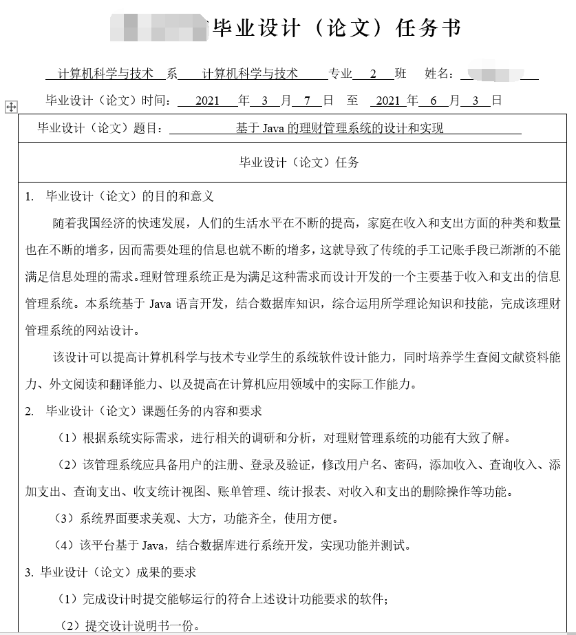 | 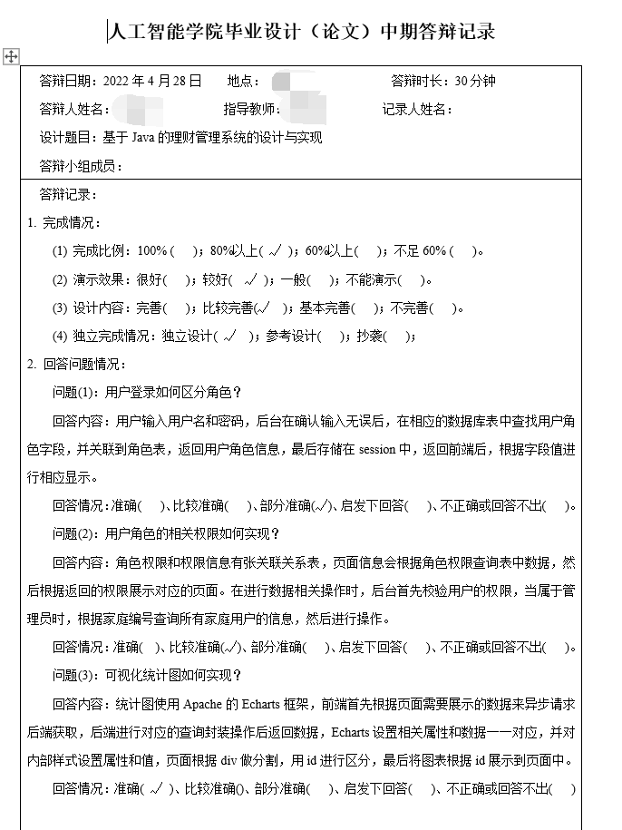 |
| ------------------------------------------------------------ | ------------------------------------------------------------ |

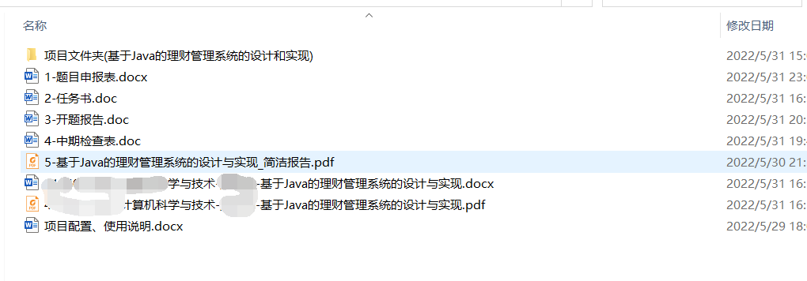

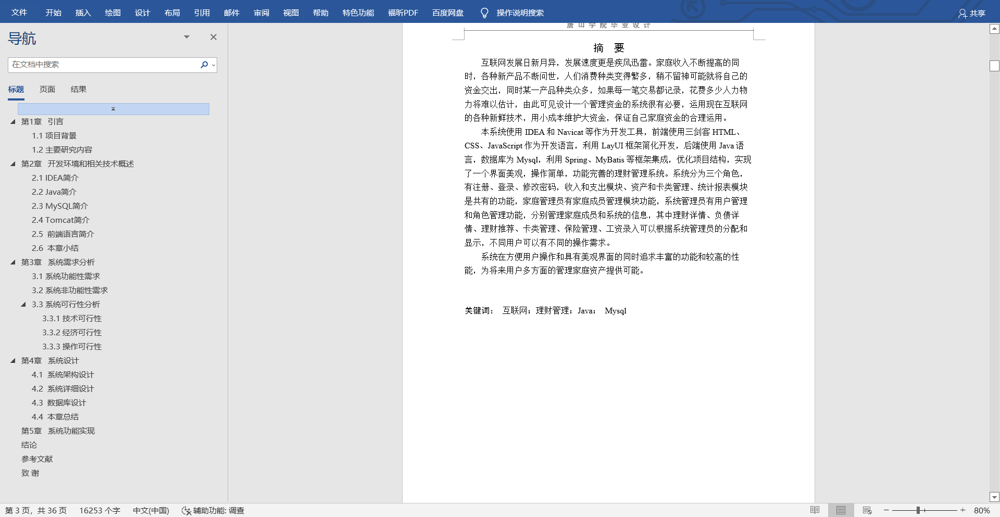

项目运行截图：

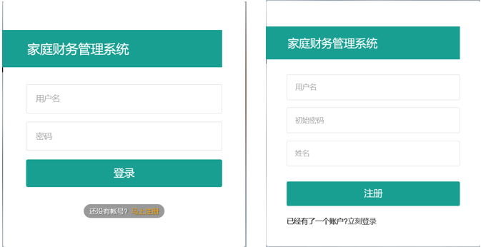

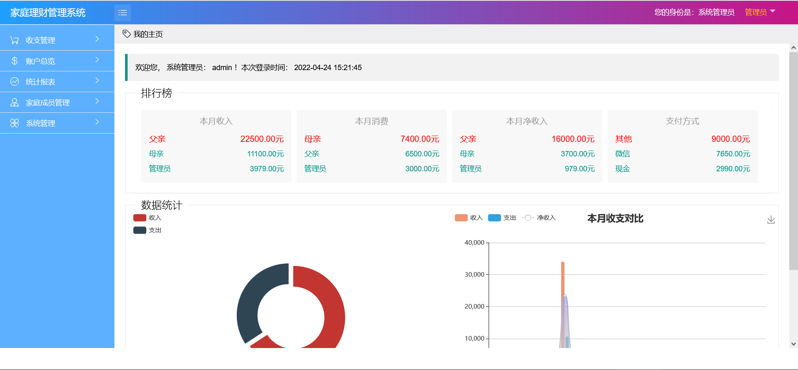

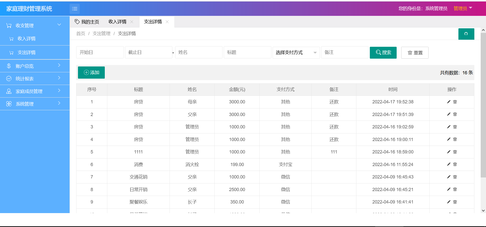

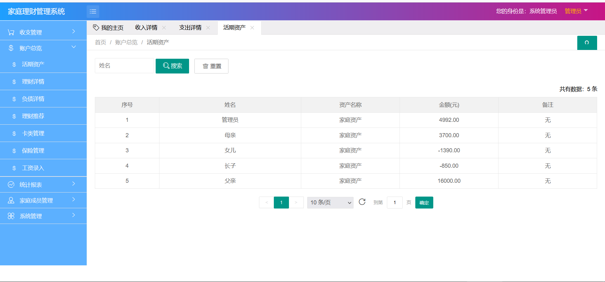

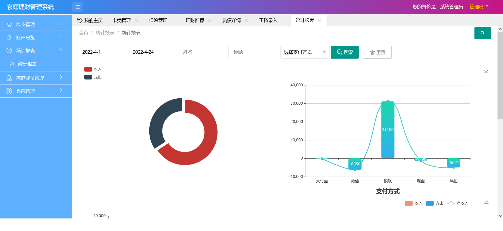

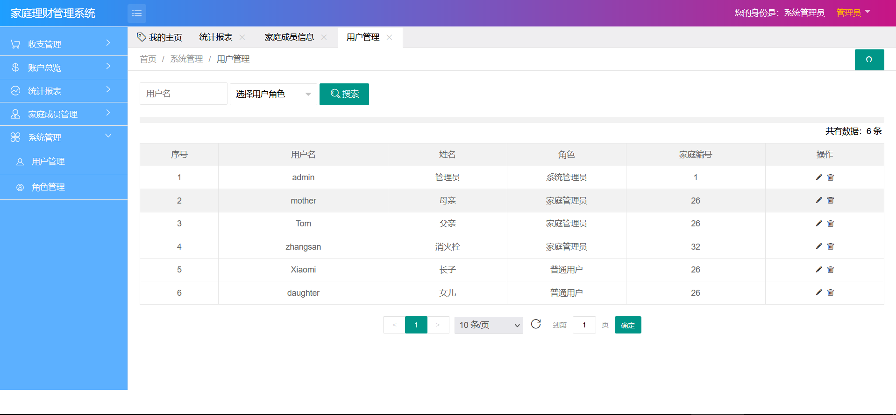

项目结构即代码：

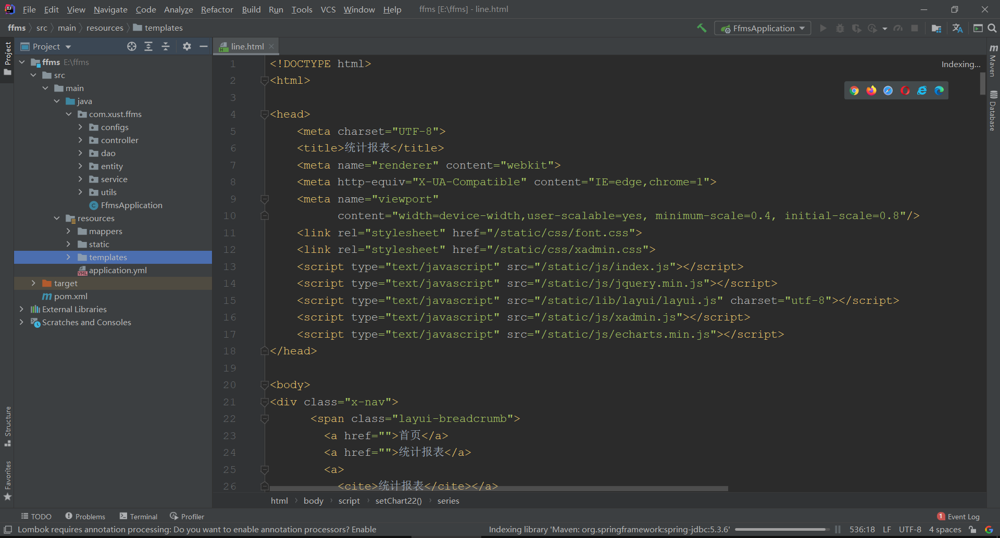

